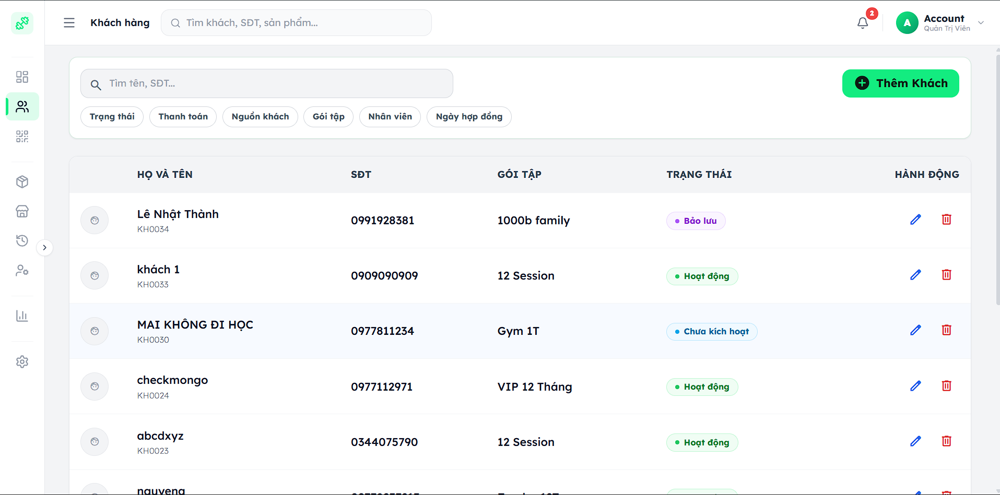

# GymPro – Gym Management System

A comprehensive gym management platform with face recognition check-in, POS, staff management, and revenue reporting.

**🔗 Live Demo:** [gym-management-eight-omega.vercel.app](https://gym-management-eight-omega.vercel.app)





---

## Overview

GymPro digitizes the day-to-day operations of small-to-medium gyms. It covers the full workflow — from member onboarding and membership management, to automated face recognition check-in, point-of-sale transactions, inventory control, staff scheduling, and revenue analytics.

---

## Features

| Module | Description |
|---|---|
| 👤 **Member Management** | Register, update, renew, or upgrade memberships |
| 📦 **Package Management** | Define and manage membership tiers and pricing |
| 🧑‍💼 **Staff & Roles** | Role-based access control (Admin, PT, Sales, Receptionist) |
| 📷 **Face Recognition Check-in** | Contactless entry via dedicated Python microservice |
| 🛒 **Point of Sale (POS)** | Sell packages and supplementary products at the counter |
| 📦 **Inventory** | Track product stock and import orders |
| 💳 **VietQR Payment** | Generate QR codes for in-person payments |
| 📊 **Reports & Analytics** | Daily/monthly revenue aggregated from real transactions |
| 📧 **Automated Emails** | Membership expiry reminders and transaction confirmations |
| 🏋️ **Workout Sessions** | Log PT sessions and track client progress |
| ✅ **Team Tasks** | Internal task management for gym staff |
| ⚙️ **Settings** | Gym profile, working hours, and notification preferences |

---

## Tech Stack

| Layer | Technology |
|---|---|
| **Backend** | Node.js, Express 5, MongoDB (Mongoose) |
| **Frontend** | React 19, Vite, TailwindCSS |
| **Face Recognition** | Python, Flask, InsightFace, Gunicorn |
| **Authentication** | JWT (jsonwebtoken), bcryptjs |
| **Email** | Nodemailer |
| **Security** | Helmet, express-rate-limit, express-validator |
| **Scheduled Jobs** | node-cron |
| **Testing** | Jest, Supertest, mongodb-memory-server |
| **Containerization** | Docker, Docker Compose |
| **Deployment** | Vercel (Frontend) · Render (Backend) · Hugging Face Spaces (Face Service) |

---

## Architecture

```
┌─────────────────┐        REST API         ┌──────────────────────┐
│   React Client  │ ──────────────────────▶ │  Node.js / Express   │
│  (Vite + TW)   │        /api/v1/          │      (Port 5000)     │
└─────────────────┘                         └──────────┬───────────┘
                                                       │
                                        ┌──────────────┴──────────────┐
                                        │                             │
                                   ┌────▼─────┐          ┌───────────▼──────────┐
                                   │ MongoDB  │          │  Face Recognition    │
                                   │ Database │          │  Service (Flask)     │
                                   └──────────┘          │  InsightFace model   │
                                                         │  [shared-secret auth]│
                                                         └──────────────────────┘
```

The face recognition service runs as an independent Python microservice, protected by a shared-secret header. The backend proxies check-in requests to this service after validating the JWT-authenticated client request.

---

## Project Structure

```
gym-management/
├── backend/                  # Node.js REST API
│   ├── config/               # DB connection
│   ├── controllers/          # Route handlers
│   ├── jobs/                 # Cron jobs (expiry checks)
│   ├── middleware/            # Auth, role guards
│   ├── models/               # Mongoose schemas
│   ├── routes/               # Express routers
│   ├── utils/                # Helpers (email, sync, etc.)
│   ├── validators/           # express-validator rules
│   ├── tests/                # Jest integration tests
│   └── server.js             # App entry point
│
├── frontend/                 # React SPA
│   └── src/
│       ├── components/       # Reusable UI components
│       ├── pages/            # Route-level page components
│       ├── context/          # React context (auth, etc.)
│       ├── hooks/            # Custom React hooks
│       ├── services/         # API call functions
│       └── utils/            # Frontend utilities
│
├── face-service/             # Python face recognition microservice
│   ├── app.py                # Flask app
│   ├── models/               # InsightFace model files
│   └── requirements.txt
│
└── docker-compose.yml        # Local full-stack setup
```

---

## Getting Started

### Prerequisites

- **Node.js** >= 18
- **MongoDB** (local or [Atlas](https://www.mongodb.com/atlas))
- **Python** >= 3.9 (for the face recognition service)
- **Docker & Docker Compose** *(optional, for containerized setup)*

---

### Option 1 — Docker Compose (Recommended)

Spin up the entire backend + frontend + MongoDB stack in one command:

```bash
# Clone the repo
git clone https://github.com/your-username/gym-management.git
cd gym-management

# Start all services
docker compose up --build
```

| Service | URL |
|---|---|
| Frontend | http://localhost:5173 |
| Backend API | http://localhost:5000/api/v1 |
| MongoDB | mongodb://localhost:27017 |

> The face recognition service must be started separately (see below).

---

### Option 2 — Manual Setup

#### 1. Backend

```bash
cd backend
npm install

# Copy and fill in environment variables
cp .env.example .env
```

Edit `.env`:

```env
PORT=5000
NODE_ENV=development
MONGO_URI=mongodb://localhost:27017/gym-management
JWT_SECRET=your_strong_secret_key

# Allowed CORS origins (comma-separated)
ALLOWED_ORIGINS=http://localhost:5173

# Email (Nodemailer)
EMAIL_USER=your_email@gmail.com
EMAIL_PASS=your_app_password
```

```bash
npm start          # production
# or
node server.js     # direct
```

#### 2. Frontend

```bash
cd frontend
npm install
npm run dev
```

The frontend dev server starts at **http://localhost:5173**.

#### 3. Face Recognition Service

```bash
cd face-service
python -m venv venv
venv\Scripts\activate          # Windows
# source venv/bin/activate     # macOS/Linux

pip install -r requirements.txt
gunicorn app:app --bind 0.0.0.0:8000
```

> On Windows without Gunicorn, use `start.bat` or run `flask run --port 8000`.

---

## Environment Variables

| Variable | Description | Required |
|---|---|---|
| `PORT` | Backend port (default: 5000) | No |
| `NODE_ENV` | `development` / `production` / `test` | Yes |
| `MONGO_URI` | MongoDB connection string | Yes |
| `JWT_SECRET` | Secret for signing JWT tokens | Yes |
| `ALLOWED_ORIGINS` | Comma-separated CORS origins | Yes |
| `EMAIL_USER` | SMTP sender email address | Yes |
| `EMAIL_PASS` | SMTP app password | Yes |

---

## API Overview

All endpoints are prefixed with `/api/v1/`.

| Prefix | Description |
|---|---|
| `POST /auth/login` | Authenticate and receive JWT |
| `GET/POST /customers` | Member CRUD |
| `GET/POST /packages` | Membership package management |
| `POST /checkin` | Face recognition check-in |
| `GET/POST /pos` | Point of Sale orders |
| `GET/POST /products` | Product catalog |
| `GET/POST /staff` | Staff management |
| `GET /dashboard` | Dashboard statistics |
| `GET /reports` | Revenue reports |
| `GET/POST /inventory` | Import orders & stock |
| `GET/POST /workout` | PT session logs |
| `GET/POST /team-tasks` | Internal task tracking |
| `GET /audit` | Audit log |
| `GET/PUT /settings` | Gym settings |

> Authentication: Include `Authorization: Bearer <token>` header on all protected routes.

**Rate Limiting:**
- Login endpoint: **20 requests / 15 min**
- All other API routes: **500 requests / 15 min**

---

## Running Tests

```bash
cd backend
npm test
```

Tests use an in-memory MongoDB instance (`mongodb-memory-server`) — no real database required.

---

## Deployment

| Service | Platform | Notes |
|---|---|---|
| Frontend | [Vercel](https://vercel.com) | Auto-deploy from `main` branch |
| Backend | [Render](https://render.com) | Uses `Dockerfile` in `/backend` |
| Face Service | [Hugging Face Spaces](https://huggingface.co/spaces) | Flask + Gunicorn |
| Database | MongoDB Atlas | Free tier available |

---

## Contributing

1. Fork the repository
2. Create a feature branch: `git checkout -b feature/your-feature`
3. Commit your changes: `git commit -m 'feat: add your feature'`
4. Push to the branch: `git push origin feature/your-feature`
5. Open a Pull Request

---

## License

This project is licensed under the **ISC License**.

---

## Author

**Lê Hùng Duy**
