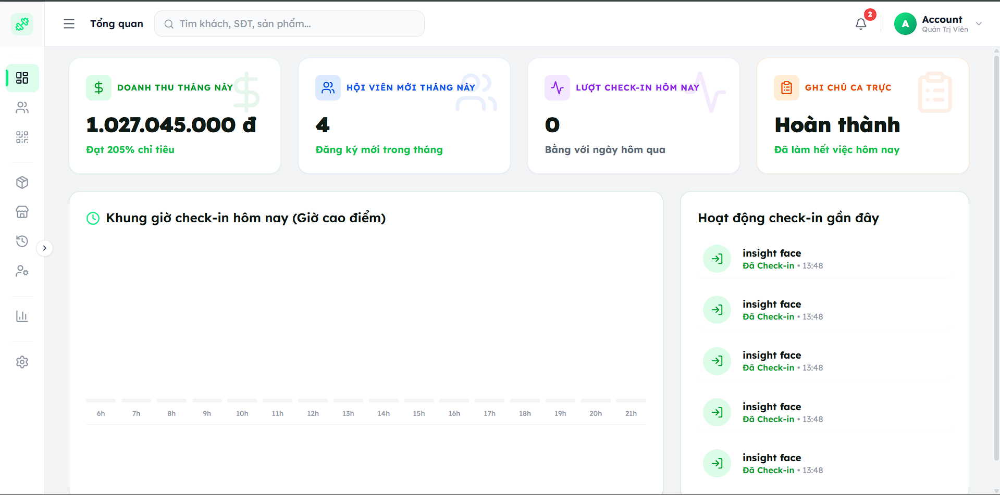
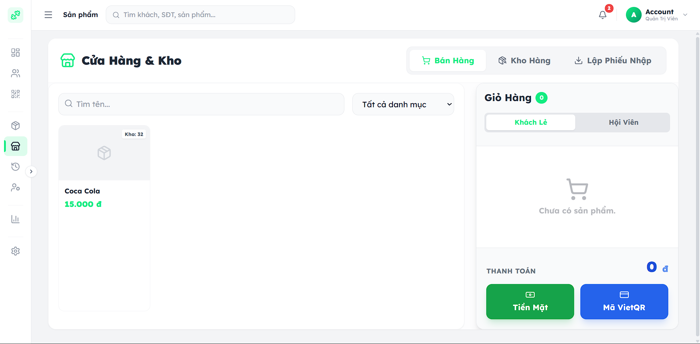

# GymPro – Hệ thống quản lý phòng tập gym

Đồ án tốt nghiệp: hệ thống quản lý phòng gym toàn diện, tích hợp check-in bằng nhận diện khuôn mặt, quản lý gói tập, bán hàng (POS) và báo cáo doanh thu.

**🔗 Demo trực tuyến:** [gym-management-eight-omega.vercel.app](https://gym-management-eight-omega.vercel.app)






---

## Giới thiệu

GymPro được xây dựng nhằm số hóa quy trình vận hành phòng gym vừa và nhỏ: từ quản lý khách hàng, gói tập, nhân viên, đến check-in tự động bằng nhận diện khuôn mặt và thanh toán VietQR. Dự án là đồ án tốt nghiệp ngành Công nghệ thông tin (chương trình Việt – Nhật, Đại học Phenikaa).

## Tính năng chính

- **Quản lý khách hàng & gói tập:** đăng ký, gia hạn, nâng cấp gói tập
- **Check-in bằng nhận diện khuôn mặt:** xác thực qua microservice nhận diện khuôn mặt riêng biệt
- **Bán hàng (POS):** bán gói tập, sản phẩm phụ trợ tại quầy
- **Quản lý nhân viên:** phân quyền theo vai trò (admin, PT, sales, lễ tân)
- **Thanh toán VietQR**
- **Báo cáo doanh thu:** tổng hợp theo ngày/tháng từ dữ liệu giao dịch thực tế
- **Thông báo email tự động** (nhắc hạn gói tập, xác nhận giao dịch)
- **App di động cho nhân viên** (PT & Sales) – bản nội bộ riêng

## Công nghệ sử dụng

| Thành phần | Công nghệ |
|---|---|
| Backend | Node.js, Express, MongoDB |
| Frontend (Web) | React 19, Vite, TailwindCSS |
| Nhận diện khuôn mặt | InsightFace, Flask (Python microservice), Gunicorn |
| Email | Brevo API |
| Triển khai | Vercel (frontend), Render (backend), Hugging Face Spaces (face recognition service) |

## Kiến trúc tổng quan

```
Client (React) ──▶ Backend API (Node/Express) ──▶ MongoDB
                          │
                          ▼
              Face Recognition Service (Flask/InsightFace)
                  [bảo vệ bằng shared-secret header]
```

## Hướng dẫn cài đặt

### Yêu cầu
- Node.js >= 18
- MongoDB (local hoặc Atlas)
- Python >= 3.9 (cho service nhận diện khuôn mặt)

### Backend
```bash
cd server
npm install
cp .env.example .env   # điền MONGO_URI, JWT_SECRET, BREVO_API_KEY...
npm run dev
```

### Frontend
```bash
cd client
npm install
npm run dev
```

### Face Recognition Service
```bash
cd face-service
pip install -r requirements.txt
gunicorn app:app
```

## Một số vấn đề kỹ thuật đã phát hiện và xử lý

- **Trùng lặp dữ liệu:** phát hiện dữ liệu bị duplicate giữa `Customer` và `CustomerPackage`, tái cấu trúc lại schema để dùng reference thay vì lưu trùng.
- **Bảo mật:** rà soát và bổ sung `helmet`, rate-limiting, giới hạn lại CORS (trước đó đang mở toàn bộ).
- **Báo cáo doanh thu sai lệch:** phát hiện báo cáo tổng hợp nhầm từ `Customer.price` thay vì từ bảng `Transaction`, sửa lại nguồn tổng hợp để phản ánh đúng giao dịch thực tế.
- **Hiệu năng nhận diện khuôn mặt:** chuyển xử lý từ client-side (face-api.js) sang server-side (InsightFace/Flask) để tăng độ chính xác và giảm tải cho thiết bị client.

## Tác giả

Lê Hùng Duy 
